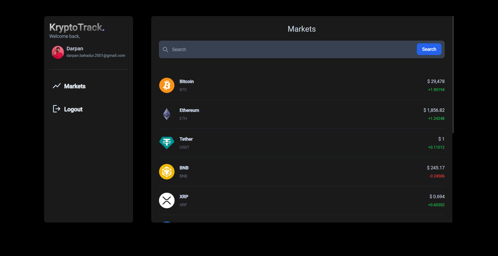

<!-- Improved compatibility of back to top link: See: https://github.com/othneildrew/Best-README-Template/pull/73 -->
<a name="readme-top"></a>
<!--
*** Thanks for checking out the Best-README-Template. If you have a suggestion
*** that would make this better, please fork the repo and create a pull request
*** or simply open an issue with the tag "enhancement".
*** Don't forget to give the project a star!
*** Thanks again! Now go create something AMAZING! :D
-->


<!-- PROJECT SHIELDS -->
<!--
*** I'm using markdown "reference style" links for readability.
*** Reference links are enclosed in brackets [ ] instead of parentheses ( ).
*** See the bottom of this document for the declaration of the reference variables
*** for contributors-url, forks-url, etc. This is an optional, concise syntax you may use.
*** https://www.markdownguide.org/basic-syntax/#reference-style-links
-->


<!-- PROJECT LOGO -->
<br />
<div align="center">

  <h3 align="center">Kryptotrack</h3>

  <p align="center">
    This project was generated with Angular CLI version 16.1.0.
  </p>
</div>


<!-- TABLE OF CONTENTS -->
<details>
  <summary>Table of Contents</summary>
  <ol>
    <li>
      <a href="#about-the-project">About The Project</a>
      <ul>
        <li><a href="#built-with">Built With</a></li>
      </ul>
    </li>
    <li>
      <a href="#getting-started">Getting Started</a>
      <ul>
        <li><a href="#prerequisites">Prerequisites</a></li>
        <li><a href="#installation">Installation</a></li>
      </ul>
    </li>
    <li><a href="#usage">Usage</a></li>
  </ol>
</details>


<!-- ABOUT THE PROJECT -->
## About The Projects


A Cryptocurrency Tracker Web Application that allows users to monitor and track the prices of various cryptocurrencies in real-time. The application will provide a user-friendly interface where users can select and track their preferred cryptocurrencies from a wide range of options.

Features:
* Implement a user-friendly interface allowing users to select and track cryptocurrencies of their choice.
* Fetch real-time cryptocurrency data from a reliable API to display up-to-date prices.
* Enable users to set lower and upper limit triggers for each tracked cryptocurrency.
* Implement a notification system that alerts users when the cryptocurrency price crosses the defined limits.
* Display graphical representations (e.g., line charts) of the price trends for the tracked cryptocurrencies.
* Provide options to customize the time frame for viewing price trends.

### Built With

This section should list any major frameworks/libraries used to bootstrap your project. Leave any add-ons/plugins for the acknowledgements section. Here are a few examples.

* Angular
* Flask
* MongoDB


<!-- GETTING STARTED -->
## Getting Started

With this platform, you'll be able to provide valuable insights and real-time data to crypto enthusiasts, investors, and traders. Here's a step-by-step guide to help you get started.

### Prerequisites

Firstly download node.js
* Node.js
  ```sh
  https://nodejs.org/en
  ```

* VS Code
  ```sh
  https://code.visualstudio.com/
  ```

* Docker
  ```sh
  https://www.docker.com/products/docker-desktop/
  ```

* Python
  ```sh
  Install Python
  ```

* Angular@CLI/16.1.0
  ```sh
  npm install -g @angular/cli@16.1.0
  ```

### Installation

Using Docker

1. Go to the parent directory /kryptotrackand type the following, if images are created then it is working fine (Angular, Flask)
  ```sh
   docker-compose up
   ```  

Clone the project and access the folder

1. Get a free API at https://www.coingecko.com/en/api
2. Clone the repo
   ```sh
   git clone https://github.com/SkullCreek/kryptotrack.git
   ```
3. Install NPM packages
   ```sh
   npm install
   ```
4. Install pip packages
   ```js
   !pip install requirements.txt
   ```


<!-- USAGE EXAMPLES -->
## Usage

Client Side
ng s -o --ssl true
Run ng serve for a dev server. Navigate to http://localhost:4200/. The app will automatically reload if you change any of the source files.

Server Side
Run py app.py and py Alert.py for a backend server which Navigates to http://localhost:5000. Aleart.py is a scheduler which sends mails for Price Alert.

Try to login with the frontend, check cryptocurrency prices and Set upper and lower bounds.
